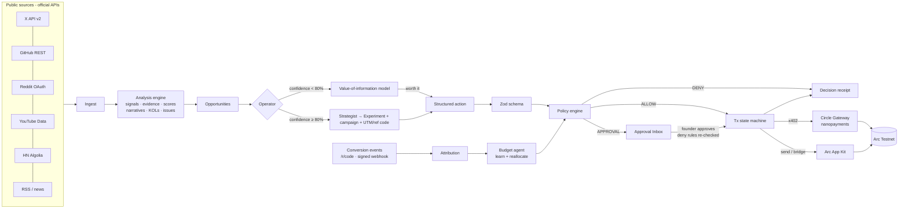

# GrowthOS

**Give your AI a growth goal and a budget.**

GrowthOS is an autonomous growth operator for Web3 and developer products. A founder gives it a product, a target customer, a goal, a timeframe, a USDC budget and hard spending rules. GrowthOS then:

- discovers who shows real intent,
- maps the narratives and the voices shaping them,
- decides what is worth pursuing, and whether extra information is worth paying for,
- spends USDC on Arc through Circle infrastructure, inside a deterministic policy engine,
- measures attributed results, and moves the next dollar toward what worked.

```
DISCOVER → UNDERSTAND → VERIFY → DECIDE → SPEND → EXECUTE → MEASURE → ATTRIBUTE → LEARN → REALLOCATE → repeat
```

It optimizes **verified growth per USDC spent**. It does not optimize followers, impressions, posts or emails sent.

---

## Contents

[Problem](#problem) · [Solution](#solution) · [Why GrowthOS](#why-growthos) · [Architecture](#architecture) · [Running it as a product](#running-it-as-a-product) · [Agent loop](#agent-loop) · [Customer discovery](#customer-discovery) · [Narrative intelligence](#narrative-intelligence) · [KOL intelligence](#kol-intelligence) · [Growth missions](#growth-missions) · [Attribution](#attribution) · [Autonomous budget](#autonomous-budget) · [Policy engine](#policy-engine) · [Circle Agent Stack](#circle-agent-stack) · [Arc App Kit](#arc-app-kit) · [Security](#security) · [Setup](#setup) · [Environment variables](#environment-variables) · [Demo](#demo) · [Testnet instructions](#testnet-instructions) · [Verification status](#verification-status) · [Known limitations](#known-limitations) · [Roadmap](#roadmap)

---

## Problem

Early-stage technical products don't lack tools for *doing* growth. They lack judgment about *where* growth is:

- Lead lists are scraped by volume and carry no evidence of intent.
- "Influencer" tools rank people by follower count, and a big audience is not a relevant one.
- Marketing dashboards summarize activity but don't decide anything.
- AI marketing assistants generate content and messages, and often spam.
- Nobody connects a dollar spent to a qualified developer acquired, so budget isn't reallocated.

## Solution

GrowthOS behaves like a growth employee with a company card and strict limits:

| It answers… | …with |
| --- | --- |
| Why this company / person / KOL? | Transparent, weighted scores with the reason behind each component |
| Why now? | Dated signals (launches, hiring, questions, migrations) with a recency decay |
| What evidence? | Every claim links to a source; purchased evidence is tagged `PAID · x402` |
| What should we do? | A measurable experiment with a hypothesis, success metric and stop condition |
| How much is it worth spending? | An expected-value-of-information model and the policy engine |
| Did it work? | First-party attribution, cost per qualified conversion, and reallocation |

## Why GrowthOS

- **It decides.** The Operator runs the loop on its own: it buys data when the information is worth more than its price, creates experiments when confidence crosses a threshold, stops losing experiments and reallocates their unspent budget.
- **Money moves only through code, never through a prompt.** Every money movement is a Zod-validated structured action, checked by a deterministic policy engine, and run through an idempotent transaction state machine.
- **Every decision gets an auditable receipt**, sha256-sealed, with the full payment trace.
- **No spam.** It never sends emails, DMs, mentions or comments. It produces the opportunity, the evidence and a draft, and a human decides.
- **No fabrication.** Every record is labelled `DEMO`, `SIMULATED`, `TESTNET` or `LIVE`. No fake posts, hashes, settlements or metrics.

---

## Architecture



**Stack:** Next.js 15 (App Router, server components and server actions), TypeScript, Tailwind v4, Drizzle ORM on Postgres, Zod, viem, Circle SDKs. The database is embedded **PGlite** by default (zero setup); set `DATABASE_URL` to use a real Postgres server. A separate Express process (`services/signals-api`) is an x402 seller paywalled with Circle Gateway.

```
src/
  app/                         routes only — pages, layouts, API handlers (thin; no business logic)
    (marketing)/  (auth)/login · signup   invite/[token]   onboarding/   app/*   api/*
  components/
    ui/                        design system: Button, Card, Badge, DataTable, Dialog, Menu, Toast, form fields…
    layout/                    app shell: sidebar, topbar, ⌘K command palette, run-agent button
    features/                  feature components (intel, wallet, approvals, integrations, team, settings…)
    charts/                    SVG charts (sparkline, stacked bar, goal progress, bar list)
  lib/                         isomorphic helpers (money, time, shell types)
  server/                      server-only
    actions/                   server actions, one module per area; each runs guard(permission) first
    auth/                      sessions, passwords, roles & permissions (access.ts), current user/workspace
    domain/
      agent/                   actions.ts (Zod) · policy.ts · ledger.ts (state machine) · decisions.ts (receipts)
                               information-value.ts · purchase.ts (x402) · execute.ts · operator.ts
      intel/                   product-analyst · crawl · signals · analyze · narratives · mentions · discovery
      scoring/                 intent.ts (customers) · kol.ts
      growth/                  experiments · attribution · learning · kol-brief · brief · graph
      workspace/               members.ts (memberships, invites, roles)
    integrations/
      circle/                  config · client · wallets (per-workspace) · signer · x402 · gateway · marketplace · appkit
      providers/               x · github · reddit · youtube · hackernews · rss · (tiktok/discord/telegram: unavailable)
      vault.ts                 encrypted per-workspace provider credentials
      llm/                     optional Claude client
    jobs/                      durable queue · scheduler (autopilot) · handlers · worker
    queries/                   read models for pages (missions, activity, metrics, shell)
    security/                  HMAC, rate limits, AES-256-GCM secrets
    db/                        schema.ts · client.ts (PGlite or Postgres) · helpers.ts
    demo/                      seed · guided script · demo enrichment fixtures
  instrumentation.ts           starts the in-process job worker
services/signals-api/server.ts x402 seller (createGatewayMiddleware)
drizzle/                       SQL migrations (applied automatically on boot)
```

**Logical agents** (deterministic code unless noted):

| Agent | Responsibility | LLM? |
| --- | --- | --- |
| Product Analyst | Reads public pages, builds the profile and ICP | Optional (Claude, structured output); heuristic fallback |
| Discovery | Queries providers, classifies intent signals, builds evidence | No |
| Narrative | Clusters conversation and computes velocity and lifecycle | No |
| KOL | Scores creators on 8 components | No |
| Strategist | Turns opportunities into experiments with stop conditions | No |
| Budget | Measures CPA, stops losers, reallocates unspent budget | No |
| Attribution | Joins conversion events to campaigns by referral code | No |
| Operator | Runs the loop and decides what happens next | No |
| Brief writer | Optional creator drafts, clearly marked as suggestions | Optional (Claude) |

An LLM never sets a score, never computes attribution, and never triggers a payment.

---

## Running it as a product

GrowthOS is multi-tenant. Everything below is per **workspace** (a product being grown).

| Capability | How it works |
| --- | --- |
| **Accounts & teams** | Email + password accounts. Workspaces have members with roles: **Owner**, **Admin**, **Member**, **Viewer**. Permissions (`src/server/auth/access.ts`) are checked in every server action and page: e.g. only Owner/Admin can change the spend policy or wallet, Members can operate the agent and approve spend, Viewers are read-only. Invites are single-use links (the token is stored hashed, expires in 7 days, and must be accepted by the invited email). |
| **Integrations** | Each workspace stores its own provider credentials (X, Reddit, YouTube, GitHub, RSS) under **Integrations**, encrypted at rest with AES-256-GCM (`ENCRYPTION_KEY`). Secrets are write-only in the UI (only a hint is shown). Resolution order: workspace key → platform default from env → keyless provider. Credentials can be tested in place. |
| **Agent wallet** | One wallet per workspace. With Circle custody, **Create agent wallet** provisions a dedicated Circle developer-controlled EOA on `ARC-TESTNET` for that workspace; an existing Circle wallet can also be attached by id. USDC is moved into Circle Gateway from the Wallet page (approve + deposit run as a background job). |
| **Autopilot** | Workspaces choose a cadence (off / hourly / every 6h / daily). A durable job queue in Postgres (`FOR UPDATE SKIP LOCKED`, leases, retries with backoff, dedupe keys) runs operator cycles, settlement polling and Gateway deposits. The worker starts inside the web server; for multi-instance deployments run `npm run worker` separately, or call `POST /api/cron/cycle` from an external scheduler. Every run and its log is visible under **Agent runs**. |
| **Inbound events** | Conversion events are posted to `/api/events`, HMAC-signed with the workspace's webhook secret (rotated from Integrations; shown once). |
| **Demo** | **See it work** creates a private guest account with its own demo workspace, labelled `DEMO` everywhere. Real workspaces are `LIVE` and never mix with demo data or metrics. |

---

## Agent loop

One operator cycle (**Run cycle**, autopilot, `POST /api/cron/cycle`; code in `src/server/domain/agent/operator.ts`), executed by the job worker:

1. **Discover / understand.** Query available providers for the product's search terms, store posts (`LIVE`), and re-run analysis.
2. **Refresh the catalog** from Circle's Agent Marketplace and the bundled seller; poll in-flight settlements.
3. **Verify.** For promising customer opportunities below the 80% commit threshold, evaluate whether buying data is worth it, and buy it over x402 if so.
4. **Decide and spend.** Opportunities at or above 80% confidence become experiments. The first tranche is proposed through the policy engine. A growing product issue **holds paid acquisition**: there's no point buying traffic into friction.
5. **Measure, attribute, learn, reallocate.** Compute CPA per experiment from the ledger and attribution, stop the ones that hit their stop condition, and move unspent budget to winners (through policy).
6. **Daily brief.** Assembled from tables, so every number is a count of real rows.

## Customer discovery

`src/server/domain/intel/signals.ts` classifies posts with auditable regex rules into intent signals: recommendation requests, competitor usage, migrations, initiatives, launches, complaints, hiring, funding, technology adoption, GitHub activity and questions. Organizations are attributed only when the source states it (an org-owned GitHub repo, a "Show HN: X" launch). Nothing is guessed from a name.

**Scoring** (`src/server/domain/scoring/intent.ts`), each component 0–100 with its reasons:

| Component | Weight | How |
| --- | --- | --- |
| Product fit | 0.25 | Overlap with product keywords and ICP segments |
| Timing | 0.20 | Recency of the top three signals (7-day half-life) |
| Buying intent | 0.25 | Noisy-OR over the strongest instance of each signal type |
| Evidence quality | 0.15 | Independent sources, provider diversity, verified via x402 |
| Engagement opportunity | 0.15 | A public question to answer, a public thread, a named contact |

**Confidence** rises only when evidence quality or signal diversity rises, so buying verified data can move it and a prompt cannot. Discovery produces evidence, a recommended approach and drafts. Contacting anyone is a human decision.

## Narrative intelligence

`src/server/domain/intel/narratives.ts`: candidate terms (product keywords plus frequent bigrams) map to post sets. Terms whose post sets are ≥75% contained in a larger theme merge into it. Each cluster gets 7-day volume, prior-7-day volume, velocity, relevance (overlap with the product vocabulary) and controversy, and a lifecycle status: `EMERGING`, `ACCELERATING`, `PEAKING`, `DECLINING`, `CONTROVERSIAL`, `UNDEREXPLORED` or `STABLE`. Each narrative shows its important voices, representative evidence, related companies and competitors involved.

**Product mentions** (`mentions.ts`) go beyond sentiment. They extract feature requests, complaints, praise, competitor comparisons, questions, purchase intent, churn risk, confusion and integration requests, and cluster recurring issues week over week. An issue that is frequent and growing fast is flagged as **blocking acquisition**, and the operator holds paid acquisition until it's addressed.

## KOL intelligence

`src/server/domain/scoring/kol.ts` scores eight components: audience fit, topic authority, recent relevance, engagement quality (discussion ratio, not likes), narrative fit, historical product fit, authenticity signals (inflated reach, promo and speculation patterns) and campaign fit. **Follower count is not a component.** It enters only log-damped (at most +10) into topic authority. In the demo, a deeply technical engineer ranks above a 450K-follower account whose audience engagement looks inflated.

The **creator brief** (`kol-brief.ts`) covers objective, why this creator, why now, audience, current narrative, core idea, product proof, a demo worth showing, angles, **claims with sources**, things to avoid, CTA, tracking link and creator freedom. Optional X / thread / video / Reels / YouTube drafts are marked as suggestions for the creator to rewrite in their own voice. GrowthOS never posts as anyone.

## Growth missions

Templates: **First 100 Developers**, **Find 20 Buyers**, **Own the Narrative**, **KOL Discovery**, each with a goal event, target, timeframe and budget split by category (research, services, KOLs, bounties, content, community). The mission result shows goal, achieved, attributed, budget, spent, cost per qualified conversion, experiments, successes and **growth efficiency**: 50% goal attainment, 30% cost efficiency vs plan, 20% hit rate.

Experiments (`growth/experiments.ts`) carry a hypothesis, target, action, budget, timeframe, success metric, **stop condition** ("CPA > X after Y spent") and the evidence they rest on. They are paid in two tranches; the first is the amount at risk before the stop condition is evaluated. The strategist never commits more than the mission's uncommitted budget.

## Attribution

- Every experiment gets a **campaign ID**, an **experiment ID**, UTM parameters and a **referral code**.
- `/r/<code>` records a first-party `visit` (rate-limited, bot-filtered, de-duplicated by a visitor cookie) and redirects to the UTM-tagged destination with `gos_ref`.
- `POST /api/events` ingests `signup`, `wallet_connect`, `sdk_key_created`, `sdk_install`, `demo_request`, `purchase` and `custom` events, HMAC-signed with a 5-minute replay window and idempotent.
- Attribution is a deterministic join on the referral code. No modelled or LLM-guessed attribution.
- The budget agent compares CPA against the mission median: SCALE at ≤60% with ≥3 conversions, REDUCE at ≥160%, STOP on the stop condition. Below 10 USDC spent, the result is "insufficient data".

## Autonomous budget

The budget view shows total, spent (settled plus in flight), committed (unspent budget reserved by live experiments) and available, plus the allocation by category. Reallocation is itself a structured `reallocate_budget` action through the policy engine. Only unspent budget can move, and large moves need approval.

## Policy engine

`src/server/domain/agent/policy.ts` is a pure function of (action, policy, state). Free-form text can't reach it: actions are parsed by Zod first (`actions.ts`).

| Rule | Severity |
| --- | --- |
| `WALLET_CONFIGURED`, `WALLET_NOT_FROZEN` (founder kill switch) | DENY |
| `ALLOWED_TOKENS` (USDC), `ALLOWED_CHAINS` | DENY |
| `FORBIDDEN_ACTIONS` (mass unsolicited messaging, automated DMs, cold email, mentions) | DENY |
| `HARD_CEILING`, `MISSION_BUDGET`, `MISSION_ACTIVE`, `APPROVED_CATEGORIES` | DENY |
| `MAX_TRANSACTION`, `DAILY_SPEND`, `CATEGORY_BUDGET` | APPROVAL |
| `CATEGORY_REQUIRES_APPROVAL` (KOL, sponsorships, bridges by default) | APPROVAL |
| `KOL_APPROVAL_THRESHOLD`, `BOUNTY_APPROVAL_THRESHOLD`, `APPROVED_SERVICES` | APPROVAL |

Examples (all unit-tested): buy research data for 0.08 USDC → **ALLOW**; pay a KOL 250 USDC → **APPROVAL REQUIRED**; transfer 2,000 USDC → **DENY**, even with founder approval. Approving waives approval-level rules for that single decision. Deny rules are re-checked at approval time.

Transactions follow a state machine (`ledger.ts`): `PROPOSED → (DENIED | AWAITING_APPROVAL → AUTHORIZED | REJECTED) → AUTHORIZED → EXECUTING → SUBMITTED → SETTLED | FAILED`, plus `SIMULATED`. Execution takes a lock with a conditional UPDATE (`AUTHORIZED → EXECUTING`), so the same decision can never be paid twice. Every transition is logged.

---

## Circle Agent Stack

All APIs below were verified against the published SDK packages: their READMEs and `.d.ts` types, plus the organizer's [`the-canteen-dev/circle-agent`](https://github.com/the-canteen-dev/circle-agent). The build environment couldn't reach the documentation sites, so nothing here comes from memory.

### Agent Wallets

`src/server/integrations/circle/wallets.ts` and `signer.ts` support two custody modes. **The AI never receives key material in either.**

- **Circle developer-controlled wallets (recommended).** Each workspace gets its own wallet set and EOA on `ARC-TESTNET` (`createWalletSet` + `createWallets({ accountType: "EOA" })`), provisioned from the Wallet page. Keys are custodied by Circle. GrowthOS holds only the platform API key and entity secret, server-side, and signs x402 authorizations through `client.signTypedData({ walletId, data })`. Gateway deposits run as `createContractExecutionTransaction` calls (`approve`, then `deposit`).
- **Server-side testnet key.** The organizer example's model (`AGENT_PRIVATE_KEY`), for local development. Refused unless `GROWTHOS_NETWORK=testnet`. It is only reachable through the policy engine.

The founder kill switch (Wallet → *Freeze all spending*) makes every spend fail `WALLET_NOT_FROZEN`.

### x402 autonomous purchasing

`src/server/domain/agent/purchase.ts` + `src/server/integrations/circle/x402.ts`:

```
need identified (confidence < 80%)
 → find a service with the needed capability (Agent Marketplace / bundled seller)
 → live quote: unpaid request → 402 + PAYMENT-REQUIRED (exact price, payTo, Gateway option on eip155:5042002)
 → expected value of information vs price  ("is this worth 0.01 USDC?")
 → purchase_service action → Zod → policy engine
 → BatchEvmScheme signs an EIP-712 TransferWithAuthorization (Circle wallet or testnet key)
 → retry with Payment-Signature → PAYMENT-RESPONSE → Circle settlement ID
 → response stored with a sha256 digest; each returned signal becomes PAID·x402 evidence
 → deterministic re-score → confidence before → after
 → decision receipt
```

The buyer mirrors `GatewayClient.pay()` from `@circle-fin/x402-batching`, split into **quote then pay**, so policy runs on the seller's actual price. A hard amount cap is enforced again inside the scheme's `onBeforePaymentCreation` hook, so a seller that raises its price between quote and payment can't be paid more than was authorized (tested).

**Value of information** (`information-value.ts`): `EVI = stake × P(decision flips) × loss fraction`, where `P(flip) ≈ min(1, expected lift ÷ gap to the threshold) × reliability`. It buys only if `price × 2 ≤ EVI` and the price is within the per-call cap. Already-confident decisions don't buy.

### Gateway nanopayments

Sub-cent purchases are signed authorizations, not one on-chain transaction each. Circle Gateway batches them. `refreshSettlements` follows each settlement through `GET /v1/x402/transfers/:id` (`received → batched → confirmed/completed`) and then resolves the Arc `submitBatch` transaction. Settlement UUIDs aren't on-chain, so the batch is matched by timestamp, the same heuristic as the organizer's `decode-batch.ts` (labelled as such). The **Arc / Circle Activity** page shows request, price, authorization, settlement ID, status, and the Arc batch tx with an explorer link.

USDC in the wallet is not spendable by x402. It must be deposited into the `GatewayWallet` (`0x0077777d7EBA4688BDeF3E311b846F25870A19B9` on Arc Testnet) first: Wallet → **Deposit to Gateway** (runs as a background job and records both transaction hashes).

### Agent Marketplace

`src/server/integrations/circle/marketplace.ts` queries Circle's keyless Discovery API, `GET https://api.circle.com/v2/x402/discovery/resources?query=&category=&limit=&siwx=false`, the endpoint the official `circle services search` CLI uses. It caches vendors and services, infers capabilities (`company_enrichment`, `creator_audience`, `narrative_pulse`, `research`), and prefers services payable on Arc via Gateway batching. `APPROVED_SERVICES` controls which hosts may be bought from autonomously.

### Bundled x402 seller

`services/signals-api/server.ts` is paywalled with `createGatewayMiddleware({ sellerAddress, networks: ["eip155:5042002"], facilitatorUrl })`, exactly like the organizer's example. It plays an independent data vendor, so the purchase path is real end to end:

- `/v1/company-intel` ($0.01): GitHub org activity and recent HN launches, hiring and funding, read live from public APIs.
- `/v1/narrative-pulse` ($0.005): weekly HN story volume for a term.
- `/v1/creator-audience` ($0.02): returns `available: false` for real creators, because no permitted public source exposes audience composition. GrowthOS reports that rather than inventing numbers.

The fictional demo entities get fixtures tagged `dataMode: "DEMO"`.

## Arc App Kit

Used where it solves a GrowthOS problem (`src/server/integrations/circle/appkit.ts`):

| Capability | Used for |
| --- | --- |
| **Send** | Approved creator payments, bounties, partner incentives: `kit.send({ from: { adapter, chain: "Arc_Testnet" }, to, amount, token: "USDC" })` |
| **Bridge** | Moving budget to the chain a payment must land on (e.g. a Base Sepolia bounty): `kit.bridge(...)`, approval-gated as `treasury` |
| **Unified Balance** | A chain-abstracted view of Gateway capital across Arc, Base Sepolia and Arbitrum Sepolia: `kit.unifiedBalance.getBalances({ sources: { address, chains }, networkType: "testnet" })` |
| **Onramp** | Optional "Add budget": `@circle-fin/onramp-kit` session route (founder-authorized) and widget |
| **Earn** | Recommendation only. GrowthOS computes idle capital beyond two weeks of run rate. Execution is not enabled: Earn Kit is marked "coming soon" in its README, and yield decisions are never autonomous. |
| **Borrow** | Not built. The finance layer (ledger, policy, receipts, attribution history) is where a future "campaign credit" would plug in. |

The adapter is `@circle-fin/adapter-circle-wallets` for Circle custody, or `@circle-fin/adapter-viem-v2` for a testnet key.

---

## Security

- **Server-side secrets only.** The Circle API key, entity secret and testnet key are read in server code. The UI and the LLM never see them.
- **Wallet isolation.** Circle custody or a testnet-only key; a kill switch; a hard ceiling no approval can exceed.
- **Spending policies** in code, re-checked at approval time.
- **Schema validation.** Zod on every financial action, form and webhook body.
- **Idempotency and duplicate-payment protection.** Unique idempotency keys on transactions and events, plus a conditional `AUTHORIZED → EXECUTING` lock.
- **Transaction state machine** with legal transitions only, and a full trail in `transaction_events`.
- **Authorization.** Signed httpOnly session cookies (HMAC-SHA256, `SESSION_SECRET`), scrypt password hashing, and workspace membership + role permission checks on every action and page.
- **Secrets at rest.** Provider credentials are AES-256-GCM encrypted with the workspace and provider bound as additional authenticated data; they are never sent back to the browser. Invite tokens are stored as sha256 hashes.
- **Rate limits** on login, signup, demo entry, agent cycles, redirects and event ingestion.
- **Webhook verification.** HMAC with a timestamp window for conversion events; ECDSA verification against Circle's published public key for Circle notifications (`/api/webhooks/circle`).
- **Audit logs** for logins, policy changes, approvals, freezes and every agent decision.
- **Tamper-evident receipts** (sha256 of canonical JSON, recomputed on view).
- Security headers (`X-Frame-Options: DENY`, `nosniff`, `Referrer-Policy`, `Permissions-Policy`); `robots.txt` honored when reading product sites.

---

## Setup

Requires Node 20+.

```bash
npm install
cp .env.example .env.local     # everything optional for the demo
npm run dev                    # web on :3000 + x402 seller on :4021
```

Open http://localhost:3000 and click **SEE IT WORK**. No keys needed.

| Script | What it does |
| --- | --- |
| `npm run dev` | Next.js and the bundled x402 seller |
| `npm run worker` | Standalone job worker (use with `GROWTHOS_WORKER=off` on web instances) |
| `npm test` | Unit tests: policy, scoring, narratives, learning, security, offline x402 round-trip |
| `npm run typecheck` | `tsc --noEmit` |
| `npm run build && npm start` | Production (set `SESSION_SECRET` and `ENCRYPTION_KEY`) |
| `npm run db:seed` | Reset and seed the demo project |
| `npm run demo:run` | Run the 8-step demo headlessly |
| `npm run wallet:setup` | Platform custody setup: `-- --entity-secret` registers a Circle entity secret, `-- --local` prints a testnet key |
| `npm run db:generate` | Generate a migration after schema changes |

> PGlite is single-process. Stop the dev server before running `db:seed` / `demo:run` against the same `.data/pglite`, or point `PGLITE_DIR` elsewhere. Use `DATABASE_URL` (Postgres) for multi-process deployments.

## Environment variables

See [`.env.example`](.env.example). In summary:

| Variable | Purpose |
| --- | --- |
| `SESSION_SECRET` | Session signing (required in production) |
| `ENCRYPTION_KEY` | AES-256-GCM key for integration credentials (required in production) |
| `GROWTHOS_WORKER`, `WORKER_INTERVAL_MS` | In-process job worker on/off and poll interval |
| `DATABASE_URL` | Postgres; empty → embedded PGlite |
| `CIRCLE_API_KEY`, `CIRCLE_ENTITY_SECRET` | Circle custody for per-workspace agent wallets |
| `AGENT_PRIVATE_KEY`, `GROWTHOS_NETWORK=testnet` | Alternative: server-side testnet key |
| `SIGNALS_SELLER_ADDRESS`, `SIGNALS_API_URL` | Bundled x402 seller |
| `DEMO_PAYOUT_ADDRESS` | Where demo creator payouts go on testnet |
| `ONRAMP_API_KEY` | Arc Onramp (optional) |
| `ANTHROPIC_API_KEY` | Claude for product reading and drafts (optional) |
| `GITHUB_TOKEN`, `X_BEARER_TOKEN`, `REDDIT_CLIENT_ID/SECRET`, `YOUTUBE_API_KEY`, `RSS_FEEDS` | Platform-default market data credentials (workspaces can bring their own) |
| `CRON_SECRET` | External scheduler endpoint (`/api/cron/cycle`) |

## Demo

**Mission: First 100 Developers. Budget: 500 test USDC.** Meterline is a fictional AI-agent developer tool. The seeded corpus (44 fictional posts, 3 companies, creators, 3 earlier experiments with fictional conversions) is visibly `DEMO` and links to `/demo/source/*` pages that say so. It is fed through the **same ingest and analysis engine** as live data, so the scores, narratives and rankings you see are computed, not hard-coded.

The guided demo (`/app/demo`, or `npm run demo:run`) runs the real engine functions:

1. **Detect.** Acme Labs shows intent (CTO asking about x402, a stablecoin payments initiative), but confidence is 60%, below the 80% threshold. The narrative engine sees x402 *emerging* and agent payments *accelerating*.
2. **Buy information.** It finds the `company-intel` x402 service, quotes it, and computes EVI ≈ 5.00 USDC against a 0.01 USDC price (500×). Policy: **ALLOW**. It pays through Circle Gateway, receives three hiring, funding and adoption signals, and confidence goes **60% → 90%**.
3. **Experiment.** The strategist picks @ada_ships (ranked above an account with 5× the followers) and creates experiment #4: 150 USDC, success = 5 SDK keys, stop if CPA > 30 after 75 spent.
4. **Brief.** An evidence-backed creator brief with sourced claims.
5. **Payment above the limit.** The 75 USDC first tranche hits `CATEGORY_REQUIRES_APPROVAL`, `MAX_TRANSACTION` and `DAILY_SPEND`, so it goes to the Approval Inbox.
6. **Founder approves.** Deny rules are re-checked, then App Kit Send runs on Arc.
7. **Conversion events** arrive through the real attribution path (38 visits, 10 SDK keys, labelled DEMO).
8. **Learn and reallocate.** @marcus_onchain hit its stop condition (CPA 37.50) and stops. The technical quickstart (CPA 2.21) scales. Its 25 USDC of unspent budget moves by policy, and receipts record the whole history.

Without a wallet, steps 2 and 6 are recorded as **SIMULATED**: the full decision and policy path runs, nothing moves, and no settlement ID or hash is shown. With a funded testnet wallet and the seller running, the same steps produce real Circle settlement IDs and Arc transactions.

## Testnet instructions

1. Create a Circle developer account and a **test** API key at console.circle.com and set `CIRCLE_API_KEY`.
2. `npm run wallet:setup -- --entity-secret` → set `CIRCLE_ENTITY_SECRET` (back up the recovery file).
3. Sign up, create a workspace, and open **Wallet → Create agent wallet**. GrowthOS provisions a Circle wallet for that workspace. (For local development, `npm run wallet:setup -- --local` → `AGENT_PRIVATE_KEY` instead.)
4. Fund the wallet address with Arc Testnet USDC at https://faucet.circle.com. On Arc, USDC is also the gas token.
5. **Wallet → Deposit to Gateway** moves USDC into Gateway for x402. Arc credits deposits in about a second.
6. Set `SIGNALS_SELLER_ADDRESS` to an Arc Testnet address you control (it receives the x402 payments), and optionally `DEMO_PAYOUT_ADDRESS`.
7. `npm run dev`, enter the demo, **Reset demo**, then run the loop. Purchases show `TESTNET` with a Circle settlement ID. Use **Refresh settlements** on the Activity page to follow them to the Arc batch tx (a batch can take around 10 minutes on testnet).

## Verification status

What was verified in the build environment:

- `npm test`: all tests pass. They also cover the job queue (claiming, dedupe, retries and leases on an in-memory Postgres). They cover policy verdicts (allow / approval / deny, deny-after-approval), schema rejection of free-form and malformed actions, scoring, narrative lifecycle, issue gating, learning and reallocation on the spec's KOL A / KOL B / content example, HMAC, the state machine, rate limits, and an **offline x402 round-trip**. In that test, Circle's `BatchEvmScheme` signs against a mock seller using the exact `PAYMENT-REQUIRED` / `Payment-Signature` / `PAYMENT-RESPONSE` wire format, the EIP-712 signer is recovered, and over-price payments are refused.
- `npm run typecheck` and `npm run build` are clean. The production server was smoke-tested.
- The full demo loop, onboarding, signed event ingestion (valid / replay / tampered / stale) and tracked redirects were exercised in a real browser and with HTTP requests.

**Not verified here:** live calls to Circle (Gateway facilitator, Discovery API, Wallets API), the Arc RPC, and the documentation sites. The build environment's network policy blocked those hosts. The bundled seller was confirmed to reach out to Circle's facilitator (`getSupported`) and be refused by the sandbox proxy. Live testnet settlement therefore still needs to be run on a networked machine with the steps above. GrowthOS records whatever actually happens and never fills the gap with fabricated data.

## Known limitations

- **No live settlement in the build environment** (see above). The code paths follow Circle's SDKs and the organizer's example. First real-network runs may surface integration details (e.g. account-type requirements for Circle-signed EIP-712, exact `GetBalances` chain identifiers) that the SDK types alone can't reveal.
- **Provider coverage depends on credentials.** Without X, Reddit or YouTube keys, discovery uses GitHub and Hacker News (and RSS if configured). TikTok, Discord and Telegram are declared interfaces that report unavailable, because there's no permitted access path in this build.
- **Entity resolution is conservative.** Companies come from explicit attribution (GitHub orgs, "Show HN"). Cross-platform creator identity is matched by handle and flagged *unverified*.
- **Heuristic product analysis without Claude** leaves competitors and use cases for the founder to fill in, by design.
- **Creator audience composition** has no permitted public source; GrowthOS reports `available: false` instead of estimating.
- **PGlite is single-process.** Use Postgres (`DATABASE_URL`) for multi-instance deployments and a separate `npm run worker`. The in-memory rate limiter is per-instance.
- **No outbound email.** Invites produce a one-time link for the inviter to share.
- **Batch-tx resolution** for x402 settlements is a timestamp heuristic, as in the organizer's example.
- **Earn is recommendation-only. Borrow is not built.**

## Roadmap

- Run and pin a live Arc Testnet settlement trace (snapshot the batch, as the organizer's example does).
- Circle webhook subscriptions for wallet transactions, replacing polling for App Kit transfers.
- A per-service reliability score learned from purchased-data outcomes (feeding the EVI model).
- Multi-touch attribution windows and holdout experiments.
- Discord and Telegram providers for communities that invite the bot.
- Earn execution behind explicit founder policy once Earn Kit is GA, then campaign credit backed by attribution history.
